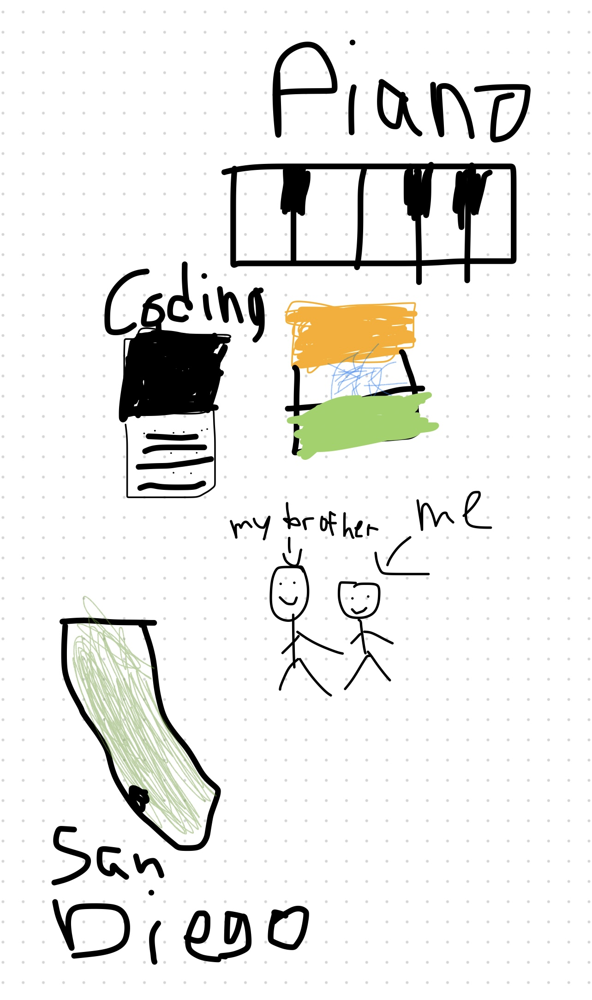

# 
Akhil's Blog

---
## About Me 
- CSP is lit
- Valorant Enthusiast (Diamond 2)
     - 
- Sophomore :)
- 
- Cool video I found interesting
- <iframe width="660" height="360"
src="https://www.youtube.com/embed/cFslUSyfZPc">

## Why I'm doing CSP
I have been doing coding for the past year, and I have slowly fallen down into the rabbit hole that is coding. From doing USACO to writing small and simple projects such as a calculator, I have enjoyed coding things more and more. I'm taking CSP to learn how to think more like a coder and advance my skills in working with others and problem-solving.

## Plans for CSP

- [x] Create a GitHub Repository
- [x] Figure out how to debug code with errors
- [ ] Learn JavaScript and Python
- [ ] Create my first project
- [ ] Collaborate with others on projects
